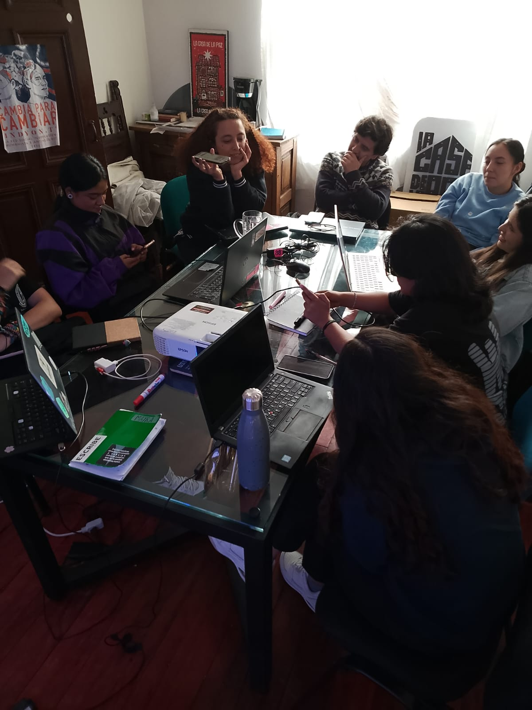

# lacasadelapaz
Este es un proyecto en construcción para el equipo de alumnas de las practicas realizadas en La Casa de la Paz. Bienvenidos y bienvenidds a revisar el proceso y comentar sobre el mismo. 
En este espacio estamos utilizando algunas herramientas que nos están permitiendo construir una cartografía de las comunidades que forman La Casa de la Paz. 

# Encuentros de creación colectiva:
En estos espacios nos reunimos una vez por semana a aprender de forma autónoma y colaborativa sobre herramientas digitales que nos peermitan narrar las historias de las comunidades con las que trabajamos. Para ello, utilizamos herramientas como

- p5.js: Una biblioteca de Javascript que facilita la creación de gráficos y animaciones interactivas en la web. 
- Ejercicios de escritura creativa: Organizamos dinpamicas personales y grupales de escritura para explorar y expresar nuestras ideas a partir de estímulos como la fotografía, el sonido, el video y más. 

# Herramientas de colaboración en línea:
Para facilitar la colaboración y el intercambio de ideas, utilizamos las siguientes herramientas en línea:
- GitHub: Plataforma de desarrollo colaborativo que utilizamos para gestionar el código del proyecto y documentar nuestro progreso.
- p5.js Web Editor: Entorno en línea para escribir y ejecutar código p5.js directamente en el navegador.

# Actualmente estamos trabajando en:
- Crear visualizaciones interactivas que representen las historias y experiencias de las comunidades.
- Desarrollar narrativas digitales que combinen texto, imágenes y multimedia para contar las historias de manera atractiva.
- Experimentar con diferentes formatos y estilos para encontrar la mejor manera de comunicar nuestras ideas.
- Fomentar un ambiente de aprendizaje colaborativo donde todas las participantes puedan compartir sus conocimientos y habilidades.
- Construir la página web del proyecto para mostrar nuestro trabajo y facilitar el acceso a la información.

  <a href="https://github.com/carmavals/lacasadelapaz" target="_blank" style="text-decoration: none;">
    <button style="background: #24292f; color: #fff; border: none; border-radius: 8px; padding: 18px 36px; font-size: 1.3em; margin: 10px; cursor: pointer; box-shadow: 0 2px 8px rgba(0,0,0,0.15);">
      Entrar al repositorio GitHub
    </button>
  </a>
  <a href="https://carmavals.github.io/lacasadelapaz/proyecto.html" target="_blank" style="text-decoration: none;">
    <button style="background: #1976d2; color: #fff; border: none; border-radius: 8px; padding: 18px 36px; font-size: 1.3em; margin: 10px; cursor: pointer; box-shadow: 0 2px 8px rgba(0,0,0,0.15);">
      Entrar a la web del proyecto
    </button>
  </a>

